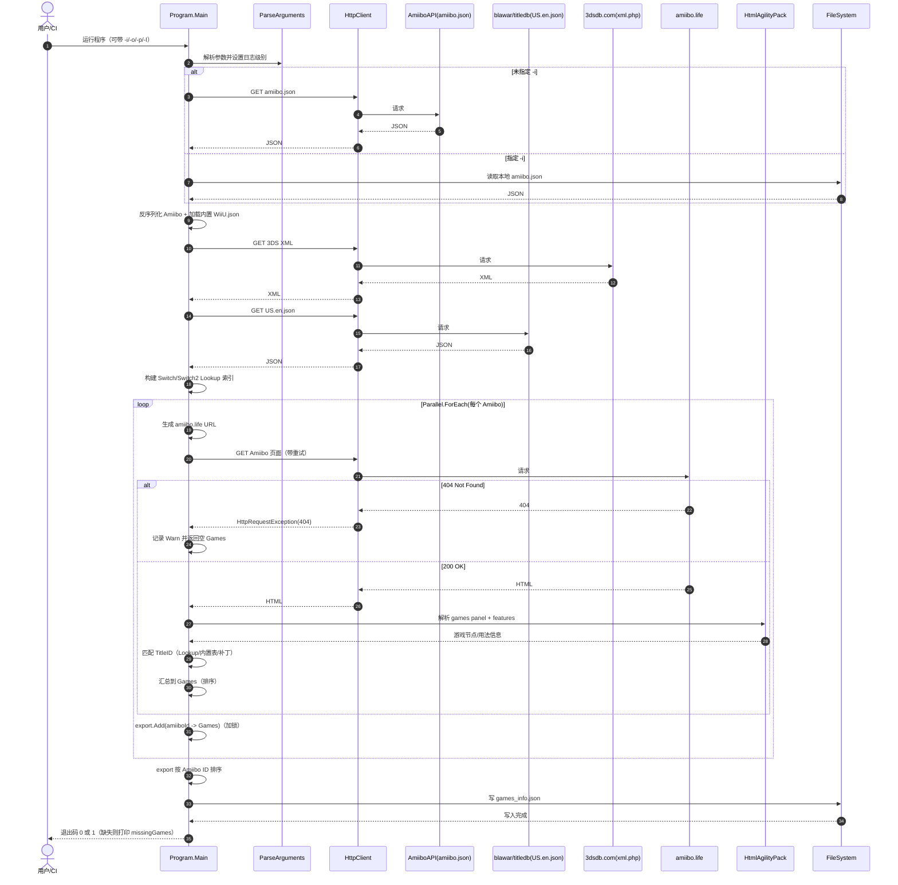

# AmiiboGameListGenerator 工作流程（Codex 版）

本文档面向贡献者，描述本仓库的端到端工作流程、核心逻辑、关键数据结构与错误管理策略，并提供逻辑图与时序图，便于快速理解与排障。

## 1. 项目目标与产出

**目标**：生成 `games_info.json`，用于 AmiiboAPI，描述“每个 Amiibo 在哪些游戏可用、如何使用（Read / Read+Write）”。

**输入（默认在线抓取）**：
- Amiibo 清单：`https://raw.githubusercontent.com/N3evin/AmiiboAPI/master/database/amiibo.json`（可用 `-i` 指定本地文件）。
- Switch / Switch2 标题库：`https://raw.githubusercontent.com/blawar/titledb/master/US.en.json`。
- 3DS 标题库：`http://3dsdb.com/xml.php`（XML）。
- Wii U 标题库：内置资源 `AmiiboGameList/Properties/Resources.resx`（来自 `AmiiboGameList/resources/WiiU.json`）。
- 用法来源：对每个 Amiibo 抓取 `amiibo.life` 页面（URL 由规则生成，部分场景会先走搜索页）。

**输出**：
- `games_info.json`（默认写到当前目录；用 `-o` 指定路径）。

## 2. 关键入口与参数

入口：`AmiiboGameList/Program.cs` 的 `Main(string[] args)`。

参数解析：`ParseArguments` 支持：
- `-i | -input {filepath}`：本地 `amiibo.json`。
- `-o | -output {filepath}`：输出文件路径。
- `-p | -parallelism {value}`：并行度（默认 4）。
- `-l | -log {value}`：日志级别（`verbose/info/warn/error` 或 `0..3`）。
- `-h | -help`：帮助信息并退出。

## 3. 端到端工作流程（分阶段）

### 3.1 阶段 A：初始化与数据加载（一次性）

1. 解析参数并设置日志级别（默认 `Info`）。
2. 构建清洗用正则：用于 Switch 标题库索引时去除 `®™` 等符号，并统一大小写/标点。
3. 加载 Amiibo 数据库：
   - 若未指定 `-i`：下载 `amiibo.json`；失败则以 `InternetError` 退出。
   - 若指定 `-i`：读取本地文件；解析失败以 `DatabaseLoadingError` 退出。
   - 反序列化后，为每个 `DBAmiibo` 回填 `ID`（字典 key）。
4. 加载 Wii U 游戏库：从内置资源读取并反序列化 `List<GameInfo>`；失败以 `DatabaseLoadingError` 退出。
5. 加载 3DS 游戏库：下载 XML 并用 `XmlSerializer` 反序列化；下载失败以 `InternetError` 退出，解析失败以 `DatabaseLoadingError` 退出。
6. 加载 Switch / Switch2 游戏库：
   - 下载 `US.en.json`；失败以 `InternetError` 退出。
   - 反序列化后转换为 `Lookup<string, string>`（键：清洗后的游戏名小写；值：title id），用于快速匹配；失败以 `DatabaseLoadingError` 退出。

### 3.2 阶段 B：并行抓取与匹配（核心循环）

对所有 Amiibo（`BRootobject.rootobject.amiibos`）执行 `Parallel.ForEach`：

1. 计算当前 Amiibo 的 `URL`（`AmiiboGameList/Amiibo.cs`）：
   - **普通 figure**：按 `amiiboSeries` + 清洗后的 `Name` 组装 `https://amiibo.life/amiibo/{series}/{name}`，并对少数特殊 case 做修正（例如 “cat” 前缀、“street-fighter-6” 特例等）。
   - **Animal Crossing 卡片**：先访问 `https://amiibo.life/search?q={characterName}`，在结果中筛选卡片链接；若搜索页 404，则回退到一个可预测的默认 URL 模式并告警。
2. 抓取 Amiibo 页面 HTML：
   - 使用 `GetAmiilifeStringAsync(url, attempts=5)` 执行 HTTP GET，并实现重试/退避（详见“错误管理”）。
   - 如果遇到 **404 Not Found**：视为该 Amiibo 在 `amiibo.life` 上缺页，记录 `Warn`，并为该 Amiibo 输出空 `Games`（跳过，不中断全局）。
3. 解析 HTML（HtmlAgilityPack）：
   - 提取游戏列表：XPath `//*[@class='games panel']/a`；若为空则直接返回空 `Games`。
4. 针对每个游戏节点构建 `Game`：
   - 解析名称：`.//*[@class='name']/text()[normalize-space()]`，并对少数已知异常名称做替换（如 `Poochy &`、`Ace Combat ...+` 等）。
   - 解析用法：`.//*[@class='features']/li`，生成 `AmiiboUsage { Usage, write }`；当存在 `em` 且文本为 `(Read+Write)` 时 `write=true`；并按 `Usage` 排序以确保稳定输出。
5. 按平台分流并匹配 TitleID：
   - 平台标签来自 `.//*[@class='name']/span`，支持：`switch`、`switch 2`、`wii u`、`3ds`。
   - Switch：从 `Games.SwitchGames[game.sanatizedGameName.ToLower()]` 取 id 列表；若为空则走硬编码补丁表；仍失败则记入 `Games.missingGames`。
   - Switch2：同理使用 `Games.Switch2Games[...]`；包含少量硬编码映射（例如 `Donkey Kong Bananza`）。
   - Wii U：用 `Games.WiiUGames.Find(...Name.Contains...)` 找到候选 ids；取前 16 位；找不到则走硬编码补丁表；仍失败记 missing。
   - 3DS：对比时会去除非字母数字字符（`Regex("[^a-zA-Z0-9 -]")`），用 `Contains` 做模糊匹配；取 `titleid[..16]`；找不到则走硬编码补丁表；仍失败记 missing。
6. 结果归并：
   - 每个平台的游戏列表在 Amiibo 级别收集并排序（按 `gameName`，忽略大小写）。
   - 并行循环结束后，将每个 Amiibo 的 `Games` 放入全局 `export`（`Dictionary<Hex, Games>`），并最终按 Amiibo ID（`Hex`）排序后写出 JSON。

### 3.3 阶段 C：输出与退出码

1. 生成 `AmiiboKeyValue { amiibos = export.OrderBy(key).ToDictionary(...) }`。
2. 写文件：`JsonConvert.SerializeObject(..., Formatting.Indented)`，再将两个空格替换为 `\t`（tab 缩进）。
3. 输出缺失游戏列表（去重后逐行打印）。
4. 返回退出码：
   - `0`：完全成功且无缺失。
   - `1`：成功但存在缺失游戏（`SuccessWithErrors`）。
   - `-2`：网络错误（`InternetError`）。
   - `-3`：数据库加载/解析错误（`DatabaseLoadingError`）。
   - `-1`：未知错误（`UnknownError`）。

## 4. 核心数据结构速览

- `DBRootobject`：AmiiboAPI 的数据库模型；`amiibos` 是 `Dictionary<Hex, DBAmiibo>`。
- `DBAmiibo`：Amiibo 条目，负责 name/url 的清洗与 URL 生成（Lazy 计算）。
- `Games`：每个 Amiibo 的结果载体，含 `gamesSwitch/gamesSwitch2/gamesWiiU/games3DS` 四个列表。
- `Game`：单个游戏记录，含 `gameName`、`gameID`（可能多个）、`amiiboUsage`（按字母序）。
- `Games.missingGames`：全局缺失清单（跨线程写入，使用 `lock`）。

## 5. 错误管理与韧性设计

### 5.1 网络与抓取重试（`GetAmiilifeStringAsync`）

抓取 `amiibo.life` 页面时采用最多 5 次尝试，按尝试次数线性退避（`(attempt+1)*5000ms`），并记录 `Error/Verbose` 日志：

- **404 Not Found**：立即抛出 `HttpRequestException(StatusCode=404)`，不重试（认为资源不存在而非临时故障）。
- **WebException**：重试（常见于网络波动/连接失败）。
- **Timeout**（`TaskCanceledException` 且内部为 `TimeoutException`）：重试。
- **HTTP 5xx**：重试（服务器端临时故障）。

注意：并行主循环对 404 做了“跳过策略”，但对网络类失败（`WebException`）会以 `InternetError` 直接结束进程；这保证了“缺页可容忍、链路不稳定不容忍”的策略一致性。

### 5.2 数据源加载失败

任何基础数据库（Amiibo/WiiU/3DS/Switch）下载或反序列化失败，都将记录 `Error` 并 `Environment.Exit`：
- 下载失败：`InternetError`。
- 解析/反序列化失败：`DatabaseLoadingError`。

### 5.3 匹配失败（业务层错误）

“从游戏名匹配 TitleID 失败”属于可预期数据缺口，不中断流程：
- 捕获后将 `{gameName} ({platform})` 写入 `Games.missingGames`。
- 最终若缺失列表非空，进程以 `SuccessWithErrors (1)` 结束，且打印缺失明细，便于补充硬编码映射或修正清洗规则。

## 6. 稳定输出（Deterministic Output）约束

CI 中存在“重复生成并对比哈希”的工作流（见 `.github/workflows/check_deterministic_output.yml`），因此实现中刻意做了稳定化：
- `export` 写出前按 Amiibo `Hex` 排序。
- 每个游戏的 `gameID` 进行 `Order().Distinct()`。
- `amiiboUsage` 按 `Usage` 排序。
- 各平台游戏列表按 `gameName`（忽略大小写）排序。

如果新增逻辑涉及集合迭代/聚合，需避免依赖无序结构的遍历顺序（例如未经排序的 `Dictionary`）。

## 7. 逻辑图（Flow / Logic）

```mermaid
flowchart TD
  Start([启动 Program.Main]) --> Args[解析命令行参数]
  Args --> Load[A: 加载基础数据库]

  subgraph A["阶段 A：数据加载"]
    Load --> AmiiboSrc{是否指定 -i?}
    AmiiboSrc -->|是| AmiiboLocal[读取本地 amiibo.json]
    AmiiboSrc -->|否| AmiiboNet[下载 AmiiboAPI amiibo.json]
    AmiiboLocal --> AmiiboParse[反序列化并回填 Amiibo ID]
    AmiiboNet --> AmiiboParse

    Load --> WiiU[加载内置 WiiU.json 资源]
    Load --> DS[下载并解析 3DS XML]
    Load --> SwitchDB[下载并解析 US.en.json]
    SwitchDB --> SwitchIndex[构建 Switch/Switch2 Lookup 索引]
  end

  AmiiboParse --> B[B: 并行处理每个 Amiibo]
  WiiU --> B
  DS --> B
  SwitchIndex --> B

  subgraph B["阶段 B：并行抓取与匹配（每个 Amiibo）"]
    B --> Url[生成 amiibo.life URL（含 AC 卡片搜索/回退）]
    Url --> Fetch[抓取 HTML（最多 5 次；5xx/超时重试；404 不重试）]
    Fetch --> NotFound{404?}
    NotFound -->|是| Empty[返回空 Games；记录 Warn]
    NotFound -->|否| Parse[解析 games panel]
    Parse --> HasGames{有游戏节点?}
    HasGames -->|否| Empty
    HasGames -->|是| EachGame[遍历游戏节点]
    EachGame --> Usage[解析 features -> amiiboUsage 并排序]
    Usage --> Platform{平台标签}
    Platform -->|Switch| MatchSW[Lookup + 硬编码补丁]
    Platform -->|Switch2| MatchSW2[Lookup + 硬编码补丁]
    Platform -->|Wii U| MatchWU[内置表匹配 + 补丁]
    Platform -->|3DS| Match3DS[模糊匹配 + 补丁]
    MatchSW --> OkSW{匹配到ID?}
    MatchSW2 --> OkSW2{匹配到ID?}
    MatchWU --> OkWU{匹配到ID?}
    Match3DS --> Ok3DS{匹配到ID?}
    OkSW -->|否| Missing[记录 missingGames]
    OkSW2 -->|否| Missing
    OkWU -->|否| Missing
    Ok3DS -->|否| Missing
    OkSW -->|是| AddSW[加入对应平台列表]
    OkSW2 -->|是| AddSW2[加入对应平台列表]
    OkWU -->|是| AddWU[加入对应平台列表]
    Ok3DS -->|是| Add3DS[加入对应平台列表]
    AddSW --> EachGame
    AddSW2 --> EachGame
    AddWU --> EachGame
    Add3DS --> EachGame
    Missing --> EachGame
    EachGame --> SortPerAmiibo[平台列表排序后返回 Games]
    SortPerAmiibo --> Merge[写入全局 export（加锁）]
    Empty --> Merge
  end

  Merge --> C[C: 输出]
  subgraph C["阶段 C：输出与结束"]
    C --> SortAll[按 Amiibo ID 排序 export]
    SortAll --> Write[写 games_info.json]
    Write --> MissingOut{missingGames 为空?}
    MissingOut -->|是| Exit0[退出码 0]
    MissingOut -->|否| Exit1[打印缺失并退出码 1]
  end
```

## 8. 时序图（Sequence）



